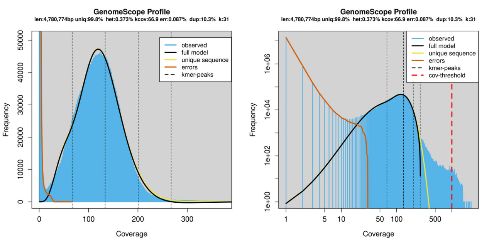
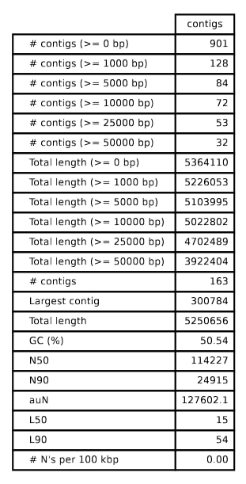
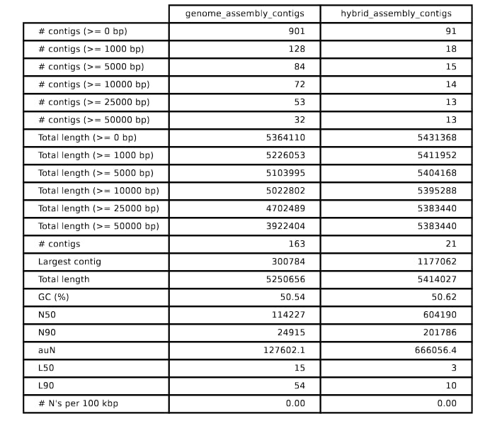
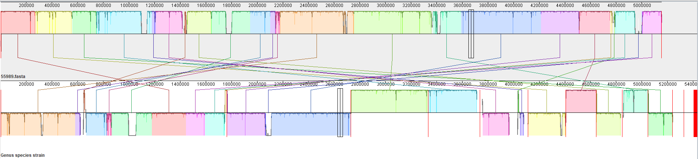
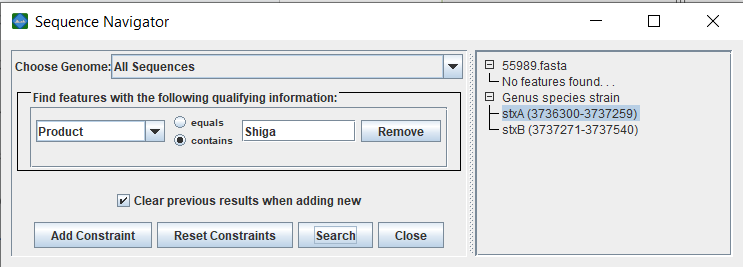
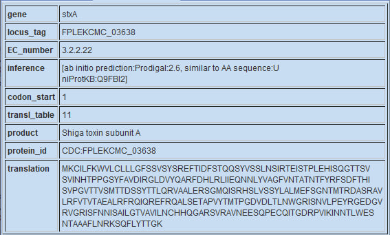
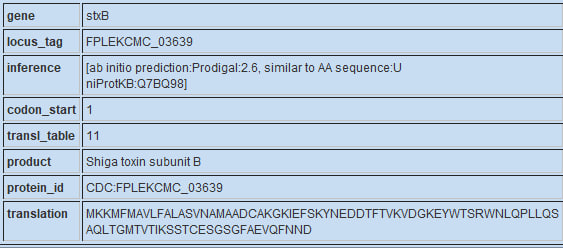
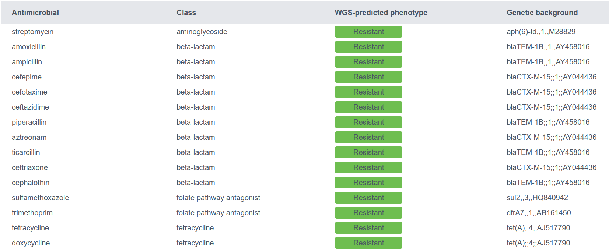
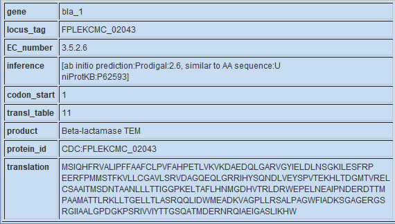
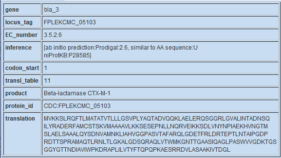

# E.coli outbreak 

## Step 1. Dataset exploration

```bash
conda --name project_3 --clone project_2
conda activate project_3
```
Get the paired-end Illumina reads (forward and reverse respectively):

```bash
wget https://d28rh4a8wq0iu5.cloudfront.net/bioinfo/SRR292678sub_S1_L001_R1_001.fastq.gz
wget https://d28rh4a8wq0iu5.cloudfront.net/bioinfo/SRR292678sub_S1_L001_R2_001.fastq.gz
```
Fastqс run to check the quality:

```bash
fastqc ./SRR292678sub_S1_L001_R1_001.fastq.gz ./SRR292678sub_S1_L001_R2_001.fastq.gz -o ./output_fastq/
```
Everything is fine, there is a small deviation from theoretical distribution of GC content. Html files are applied to this report.  
Forward and reverse read count: 5499346.

## Step 2. K-mer profile and genome size estimation

We need to install [jellyfish](https://github.com/gmarcais/Jellyfish) tool to estimate the frequency of all possible k-mers of a given length in target data.

```bash
sudo apt install jellyfish
jellyfish count -m 31 -C -s 500M -t 16 -o counts1.jf   <(gunzip -c SRR292678sub_S1_L001_R1_001.fastq.gz)   <(gunzip 
-c SRR292678sub_S1_L001_R2_001.fastq.gz)
jellyfish stats counts.jf
```
```
Stats on counts.jf:
Unique:    13894353
Distinct:  20258881
Total:     659921520
Max_count: 2250
```

Everything is fine, file isn't empty.  
Run histo command and make .txt file to build histogram.  
In this case, use [GenomeScope](http://genomescope.org/) for visualization.

```bash
jellyfish histo counts.jf > k-mer.txt
```
Parameters for visualisation: k-mer length = 31, read length = 90, max k-mer coverage = 1000.



Estimate genome size following these formulas:  
N = (M*L)/(L-K+1)  
Genome_size = T/N   
- N – depth of coverage, 
- M – k-mer peak(62), 
- K – k-mer size(31), 
- L – average read length(90), 
- T – total bases.

In this case:  
N = (62*90)/(90-31+1) = 93  
Genome_size = 494900000/93 = 5321505 bp.


## Step 3. Assembling E. coli genome from paired reads with SPAdes

### Installation

Install [SPAdes](https://ablab.github.io/spades/) via conda and run it with flag "**-- test**"
```bash
conda install spades -c bioconda
spades.py --test
```
Output:
```
Thank you for using SPAdes! If you use it in your research, please cite:

  Prjibelski, A., Antipov, D., Meleshko, D., Lapidus, A. and Korobeynikov, A., 2020. Using SPAdes de novo assembler. Current protocols in bioinformatics, 70(1), p.e102.
  doi.org/10.1002/cpbi.102
```
### Assembly

Run SPAdes to assemble the reads, make new directory for output:
```bash
spades.py --isolate -1 ./SRR292678sub_S1_L001_R1_001.fastq.gz -2 ./SRR292678sub_S1_L001_R2_001.fastq.gz -o ./genome_assembly/
```
For the subsequent analysis we will be interested only in the “contigs.fasta” and “scaffolds.fasta” files, which define contigs and scaffolds for the E. coli assembly, respectively.

These files are present in SPAdes output location.

### QUAST installation and quality assessment of contigs

Check QUAST page on [sourceforge](https://quast.sourceforge.net/).
```bash
conda install -c bioconda quast
```
However, our current Python version is 3.14 is incompatible with QUAST:

<details>
   <summary>Compatability issues</summary>

```bash
Could not solve for environment specs
The following packages are incompatible
├─ pin on python =3.14 * is installable and it requires
│  └─ python =3.14 *, which can be installed;
└─ quast =* * is not installable because there are no viable options
   ├─ quast [3.2|4.1|...|5.2.0] would require
   │  └─ python [=2.7 *|>=2.7,<2.8.0a0 *], which conflicts with any installable versions previously reported;
   ├─ quast [5.0.1|5.0.2] would require
   │  └─ python >=3.5,<3.6.0a0 *, which conflicts with any installable versions previously reported;
   ├─ quast [5.0.1|5.0.2|5.2.0] would require
   │  └─ python >=3.6,<3.7.0a0 *, which conflicts with any installable versions previously reported;
   ├─ quast [5.0.2|5.2.0] would require
   │  └─ python >=3.7,<3.8.0a0 *, which conflicts with any installable versions previously reported;
   ├─ quast [5.2.0|5.3.0] would require
   │  └─ python >=3.10,<3.11.0a0 *, which conflicts with any installable versions previously reported;
   ├─ quast [5.2.0|5.3.0] would require
   │  └─ python >=3.11,<3.12.0a0 *, which conflicts with any installable versions previously reported;
   ├─ quast [5.2.0|5.3.0] would require
   │  └─ python >=3.12,<3.13.0a0 *, which conflicts with any installable versions previously reported;
   ├─ quast [5.2.0|5.3.0] would require
   │  └─ python >=3.8,<3.9.0a0 *, which conflicts with any installable versions previously reported;
   ├─ quast [5.2.0|5.3.0] would require
   │  └─ python >=3.9,<3.10.0a0 *, which conflicts with any installable versions previously reported;
   ├─ quast 5.3.0 would require
   │  └─ python >=3.13,<3.14.0a0 *, which conflicts with any installable versions previously reported;
   └─ quast 4.6.3 would require
      └─ boost >=1.66.0,<1.66.1.0a0 * but there are no viable options
         ├─ boost 1.66.0 would require
         │  └─ python =2.7 *, which conflicts with any installable versions previously reported;
         ├─ boost 1.66.0 would require
         │  └─ python =3.5 *, which conflicts with any installable versions previously reported;
         └─ boost 1.66.0 would require
            └─ python =3.6 *, which conflicts with any installable versions previously reported.

Pins seem to be involved in the conflict. Currently pinned specs:
 - python=3.14
```
</details>  

Therefore, try to make new environment with python 3.13 and install QUAST 5.3.0. Do not uninstall and reinstall python in current env, it can corrupt some dependent packages.

```bash
conda create -n quast python=3.13
conda install -c bioconda quast
```

You can also install additional tools for this version of QUAST.
<details>

* GRIDSS (needed for structural variants detection)

* SILVA 16S rRNA database (needed for reference genome detection in metagenomic datasets)

* BUSCO tools and databases (needed for searching BUSCO genes) -- works in Linux only! 

But these packages are not related to our task and don't install them.
</details>  

Run QUAST

```bash
quast.py ./genome_assembly/contigs.fasta 
```
Report is saved in .txt, .tsv, .html, .pdf etc. 



## Step 4. Impact of long reads

Make a comparison of PacBio long read library (~20000 bp) and assembly based on Illumina library.

### Get the PacBio library

Install [sra-tools](https://github.com/ncbi/sra-tools) to handle working with large files and/or on the server.

```bash
conda install bioconda::sra-tools
fasterq-dump --split-3 SRR1980038
```
It can take some time because of large filesize, in the end we get this message with info about the downloaded data.
```
spots read      : 163,482               
reads read      : 163,482              
reads written   : 163,478 
reads too short : 4   
```
### Assembly in hybrid mode

```bash
spades.py -1 ./SRR292678sub_S1_L001_R1_001.fastq.gz -2 ./SRR292678sub_S1_L001_R2_001.fastq.gz --pacbio ./SRR1980038.fastq -o ./hybrid_assembly/ -t 8
```
Used less threads than possible because of OS error, program output warning:

```
Your data seems to have high uniform coverage depth. It is strongly recommended to use --isolate option
```
Option "**--isolate**" was omitted to get corrected libraries.



The quality was improved:
- nearly 8-fold reduction of contig count;
- largest contig is around 3 times longer than in previous assenbly;
- N50 is higher.

Therefore, overall continuity of the second assembly is higher.


## Step 5. Genome annotation

Install [Prokka](https://github.com/tseemann/prokka) (version 1.13) and run it on hybrid assembly.

```bash
conda install prokka -c bioconda
prokka --outdir ./annotated_genome/ --prefix hybrid_annotation --centre CDC ./library/hybrid_assembly/scaffolds.fasta
```
IMPORTANT NOTE:  
If error "Prokka needs blastp 2.2 or higher" occurs, find file ~/miniconda3/envs/envname/bin/prokka and make the following changes:

- Find **blastp** and **makeblastdb**
- Change parameter MINVER: 2.2 -> 2.0
- Save and exit

## Step 6. Search for the closest relative

### Barrnap rRNA search

The gene that we will use is 16S ribosomal RNA.

First, we need to locate 16S rRNA in the assembled E. coli X genome. You can use the rRNA genes prediction tool Barrnap. Find the 16S rRNA  in the results of the most recent run of SPAdes. 
rRNA genes in bacteria are typically organized in ribosomal operons – set of closely located genes that are activated together. Ribosomal RNA plays a crucial role in protein synthesis, and in order to achieve high growth rate bacteria often possess several copies of this operon. That is why you will probably get several matches here. 

Install [barrnap](https://github.com/tseemann/barrnap) (version 0.9).
```bash
conda install -c bioconda barrnap
barrnap -o ./barrnap_output/rrna.fa < ./library/hybrid_assembly/contigs.fasta > ./barrnap_output/rrna.gff
```

### BLAST search

rRNA genes in bacteria are typically organized in ribosomal operons. As it plays crucial role in protein synthesis, cells usually contain several copies of them. We will use 16s rRNa as our target gene for search. 

Open the  NCBI BLAST homepage (http://blast.ncbi.nlm.nih.gov) and select “Nucleotide blast”. To perform the search against complete genomes in the RefSeq database, select the “Reference Genome Database (refseq_genomes)” in the “Database” field, and Escherichia coli in the “Organism” field.   

Set the time range using parameter PDAT in the "Entrez Query" field and filter only time-relevant results for our strain:

```
1900/01/01:2011/01/01[PDAT]
```


The highest score sequence was downloaded.

Click on the “Sequence ID” link under the name of the identified reference in order to open its corresponding GenBank page. Download the genome sequence in FASTA format (in the right upper corner select ”Send” - “Complete Record” - “File” – “Fasta”, and save as “55989.fasta”)

Get .fasta file using efetch by ID.
```bash
efetch -db nuccore -id NC_011748.1 -format fasta > 55989.fasta
```
## Step 7. Genetic cause of HUS

To define the cause of HUS perform a genome-wide comparison with the reference genome and analyze the difference between them. 

Install [Mauve](https://darlinglab.org/mauve/download.html) and compare reference with the annotated assembly (in .gbk format).

For this report Mauve was installed on Win10 system.

Move files 55989.fasta (our reference) and .gbk file with our annotation into separate folder, check if path to files contains only latin symbols.

How to use Mauve:
"File" → "Align with progressiveMauve..." → "Add sequences" → select reference.fasta + annotation.gbk → "Start".  



Select "Product" and enter keyword "Shiga" to search shiga toxin genes related to HUS.





## Step 8. Where is the origin

If there are many "hypothetical proteins" rebuild alignment using another annotation [file](https://disk.yandex.ru/d/aWhOBLVIXR7Oaw).

Annotated proteins near Shiga-toxin associated genes are:

```
unknown protein encoded within prophage CP-933V CDS
Phage DNA adenine methylase (EC 2.1.1.72) CDS
Phage antitermination protein Q CDS
Phage protein NinH CDS
Phage recombination protein NinG CDS
Gifsy-2 prophage protein CDS
DNA primase, phage associated CDS
```

Therefore, the source of shiga-toxin within our E.coli strain is a phage infection.

## Step 9. Antibiotic resistance detection

To search for genes responsible for antibiotic resistance, we will use ResFinder (http://genepi.food.dtu.dk/resfinder), which specifically searches a database of genes implicated in antibiotic resistance, identifying similarities between the sequenced genome and this database using local alignment.

Search result:  


As the search shows: E.coli X developed resistance mostly against beta-lactam antibiotics from CTX-M and TEM families.


## Step 10. Antibiotic resistance mechanism

### What exactly provides beta-lactamase resistance?

Try to find **bla** genes associated with beta-lactamase production in Mauve.

There are three results:





**bla1** and **bla2** are copies of the same sequence (TEM family).
Product:[UniProtKB:P62593](https://www.uniprot.org/uniprotkb/P62593/entry).

**bla3** CTX-M-1, class A beta-lactamase family.   
Product:[UniProtKB:P28585](https://www.uniprot.org/uniprotkb/P28585/entry).

These results are consistent with ResFinder search results; the same families of **bla** were found.

### How could E. coli X obtain these beta-lactamase genes?

Look at neighboring regions of the last findings:

- TnpR_1 - Transposon Tn3 resolvase
- TnpR_2 - Transposon Tn3 resolvase

In the second alignment with pre-annotated file, mobile elements were also present.


[Tn3 resolvase](https://www.uniprot.org/uniprotkb/P0ADI2/entry) is a part of mobile element and may indicate a possible role of mobile genetic elements in **bla** acquisition.


## Conclusion

In this project we performed E. coli X genome assembly and found closest relative using 16s RNA.
After alignment in Mauve Shiga toxin genes were found (**stxA**, **stxB**), that caused intestinal damage cases we try to investigate. These genes originally belong to *Shigella dysenteriae* and were possibly transferred into genome of E.coli due to lambdoid prophage intervention.

The strain is resistant to some popular antibiotics: streptomycin, amoxicillin, ampicillin, trimethoprim, tetracycline, doxycycline etc. Most of the resisted antibiotics are beta-lactams and we tried to find 
beta-lactamase genes and explain their acquisition by E. coli. Mobile element proteins were found near the target **bla** genes, proving the transposon hypothesis of acquiring the resistance.


